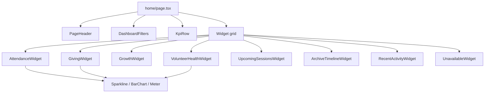

# Executive Dashboard

The executive dashboard is the signed-in home for a church workspace. It is not a
new bounded context. It is a **composition surface**: permission-gated widgets
that read live `/api/v1` list and report endpoints already owned by membership,
accounting, sermon, and memory.

It lives at `/home` on the web application. `/` remains the public marketing
page. Auth still lands on `/workspace` (account, memberships, sessions); `/home`
is the operational landing once a tenant is active.

## Why a composition surface

Zion8 is API-first. A pastor's morning view is not a new aggregate. Attendance
belongs to membership, giving belongs to the ledger, the archive belongs to
memory. Inventing dashboard-only totals would create a second set of numbers
that can drift from the books.

So the dashboard:

- Calls the same contracts the rest of the workspace uses.
- Gates every widget with `can(me, Permission.*)` from the current principal,
  not with a hardcoded role name.
- Renders an honest empty or "not shipped" state when the user has the
  permission but the bounded context has no HTTP list yet.

## Permission, not role

Roles in `packages/contracts/src/iam/permissions.ts` are a convenient default
grant. The UI must not switch on `Role.SENIOR_PASTOR`. A church can assign an
unusual combination; a widget appears when the principal holds the permission
that would authorize the same screen in the source module.

Typical coverage for the four executive audiences (derived from
`rolePermissions`, not copied into the page):

| Widget | Permission | Senior Pastor | Administrator | Finance Officer | Ministry Leader |
| --- | --- | --- | --- | --- | --- |
| Attendance | `attendance:read` | Yes | Yes | No | Yes |
| Giving | `giving:read` or `accounting:read` | Yes | No | Yes | No |
| Growth | `member:read` | Yes | Yes | Yes | Yes |
| Prayer requests | `prayer:read` | Yes | Yes | No | Yes |
| Volunteer health | `volunteer:read` | Yes | Yes | No | Yes |
| Upcoming events | `event:read` and/or `attendance:read` | Yes | Yes | No | Yes |
| Historical timeline | `memory:read` (church archive) | Yes | Yes | No | Yes |
| AI insights | `ai:ask` / `ai:recommend` / `analytics:view` | Yes | analytics | analytics | ask/recommend |
| Recent activity | union of sermon, memory, accounting, attendance | Yes | Yes | journals | ops slice |
| Notifications | `notification:read` | Yes | Yes | No | Yes |

`CHURCH_OWNER` holds every permission and therefore sees every widget.

Finance officers see money and the member directory. They do not see attendance,
volunteers, or the archive unless a church grants those permissions explicitly.

## Live APIs versus planned contexts

Production code only. Widgets never call a path that does not exist on
`apps/web/src/lib/api-client.ts`.

| Widget | Live contract | How the widget uses it |
| --- | --- | --- |
| Attendance | `GET /membership/attendance/sessions` | Session page: `attendedCount`, `kind`, `occurredAt`. Sparkline is weekly sums of the returned page. |
| Giving | `GET /accounting/reports?kind=GIVING_STATEMENT` plus `GET /accounting/contributions` | Report `netMinor` and per-fund bars are complete for the range. The contribution list is the recent activity strip. |
| Books (finance) | `GET /accounting/reports?kind=INCOME_STATEMENT` | `netMinor` for the range. Shown only with `accounting:read` or `report:read`. |
| Growth | `GET /membership/members` (`status=ACTIVE`, and `joinedAfter`/`joinedBefore`) and `GET /membership/visitors` | Directory `total` is the congregation size. Period joins use the joined-date filters. Visitor `total` is the pipeline size. |
| Volunteer health | `GET /membership/volunteer-roles` | `activeCount` / `requiredCount` / `openSlots` per role. |
| Upcoming | `GET /membership/attendance/sessions?from=now` (and `kind=EVENT` when filtered) | Open or future sessions are the operational calendar that exists today. |
| Historical timeline | `GET /memory/artifacts` | Church-wide archive, newest first. Per-member `GET /membership/members/:id/timeline` is not a church feed; it requires a member id. |
| Recent activity | sermons, memory artifacts, journals, attendance sessions | Client merge by date of the lists the principal can read. |
| Prayer requests | none | Care context is planned (`ARCHITECTURE.md`). Unavailable card. |
| Events calendar | none | Events context is planned. Upcoming sessions stand in; the card says so. |
| AI insights | contracts in `packages/contracts/src/ai/insight.schemas.ts` | No `apps/api` HTTP controller yet. Unavailable card. |
| Notifications inbox | none | `NotificationsModule` is outbound mail/SMS. No inbox list. Unavailable card. |
| Audit | none | `audit:read` exists; no audit-list client. Not shown as a widget. |

Charts are SVG/CSS primitives. `@zion8/web` has no chart library; adding one is
out of scope for a composition surface.

## Filters

The page is a GET form so every view is linkable and works without JavaScript.

| Param | Shape | Applied to |
| --- | --- | --- |
| `from` | `YYYY-MM-DD` | Attendance `from` (start of day UTC), giving/income reports, contributions, member `joinedAfter`, sermons `from`, memory `from`, journals `from` |
| `to` | `YYYY-MM-DD` | Matching `to` / `joinedBefore` / end of day UTC |
| `kind` | `AttendanceSessionKind` | Attendance list and upcoming sessions |

Default window when the query is empty: the last 90 days, inclusive. Clearing
the dates and resubmitting restores that default on the next render.

Kind `EVENT` narrows upcoming sessions to event-shaped gatherings. It does not
invent a calendar.

## Layout and responsive design

```
Desktop (>=1024)                         Tablet / phone
+------------------------------------+   +----------------------+
| Home  Members  ...  Accounting     |   | Home  Members  ...   |
+------------------------------------+   +----------------------+
| Greeting          [from][to][kind] |   | Greeting             |
| KPI  KPI  KPI  KPI                 |   | [from][to][kind]     |
| Attendance     | Giving            |   | KPI  KPI             |
| Growth         | Volunteers        |   | Attendance           |
| Upcoming       | Archive           |   | Giving               |
| Recent activity (full width)       |   | ...stacked widgets   |
| Unavailable cards (full width)     |   +----------------------+
+------------------------------------+
```

- KPI row: two columns on small screens, four on large.
- Widget grid: one column, two columns from `lg`.
- Section nav already scrolls horizontally; Home is the first item.
- Charts use a `viewBox` and `w-full` so they shrink with the card.
- Primary numbers stay text; colour is a secondary cue on badges and meters.

## Accessibility

- The shell exposes a skip link to `#workspace-main`.
- Each widget is an `<article aria-labelledby="...">` with a visible heading.
- Filter controls have `<label htmlFor>`.
- Charts are `role="img"` with an `aria-label` that states the figures.
- Meters use `role="meter"` and `aria-valuenow` / `valuemin` / `valuemax`.
- Empty and unavailable states are plain language, not colour-only.
- Focus styles reuse the existing `inputClass` ring.

## Component tree



Supporting modules:

| Module | Responsibility |
| --- | --- |
| `apps/web/src/lib/dashboard.ts` | Filter parse, parallel load, weekly series, activity merge |
| `apps/web/src/components/dashboard/charts.tsx` | SVG sparkline, bar chart, meter |
| `apps/web/src/components/dashboard/widgets.tsx` | Widget cards, filters, KPI tiles, unavailable copy |
| `apps/web/src/lib/principal.ts` | `can` / `canAny` |
| Existing `Card`, `Badge`, `EmptyState`, `PageHeader` | Visual language |

No new REST routes. No new Zod contracts. No stubs that return demo numbers.

## Wireframes (role slices)

Senior Pastor and Church Owner: full grid — attendance, giving, growth,
volunteers, upcoming sessions, archive, recent activity, plus unavailable cards
for prayer, AI insights, and notification inbox.

Administrator: same operational grid without giving/income KPIs.

Finance Officer: giving, income KPI, member/visitor growth, recent journals.
Unavailable: AI insights (they have `analytics:view`). No attendance or
volunteer cards.

Ministry Leader: attendance, growth, volunteers, upcoming sessions, archive,
recent sermons/memory. Unavailable: prayer, events calendar, AI insights,
notifications.

## Failure and empty states

- No active tenant: the dashboard layout already blocks the main slot.
- Missing permission: the widget is omitted, not shown as an error.
- Live list with `total === 0`: `EmptyState` pointing at the source screen.
- Planned context: `UnavailableWidget` naming the future module, never a fake
  count.

## Related documents

- `docs/architecture/ARCHITECTURE.md` — modular monolith and planned contexts
- `docs/architecture/MEMBERSHIP.md` — attendance, volunteers, directory
- `docs/architecture/ACCOUNTING.md` — giving, reports, journals
- `docs/architecture/MEMORY_ENGINE.md` — archive used as church timeline
- `docs/architecture/SERMON.md` — recent teachings
- `docs/architecture/ZION_AI.md` — insight contracts not yet served over HTTP
- `docs/architecture/MOBILE.md` — mobile consumes the same `/api/v1` lists
