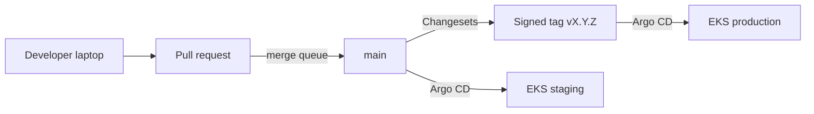
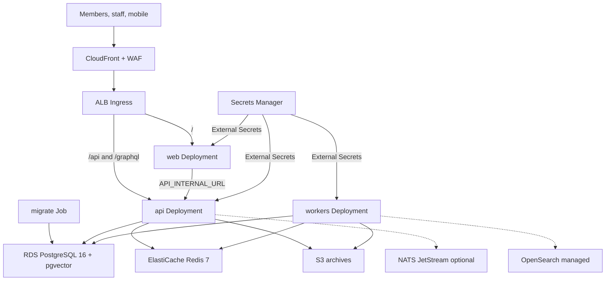
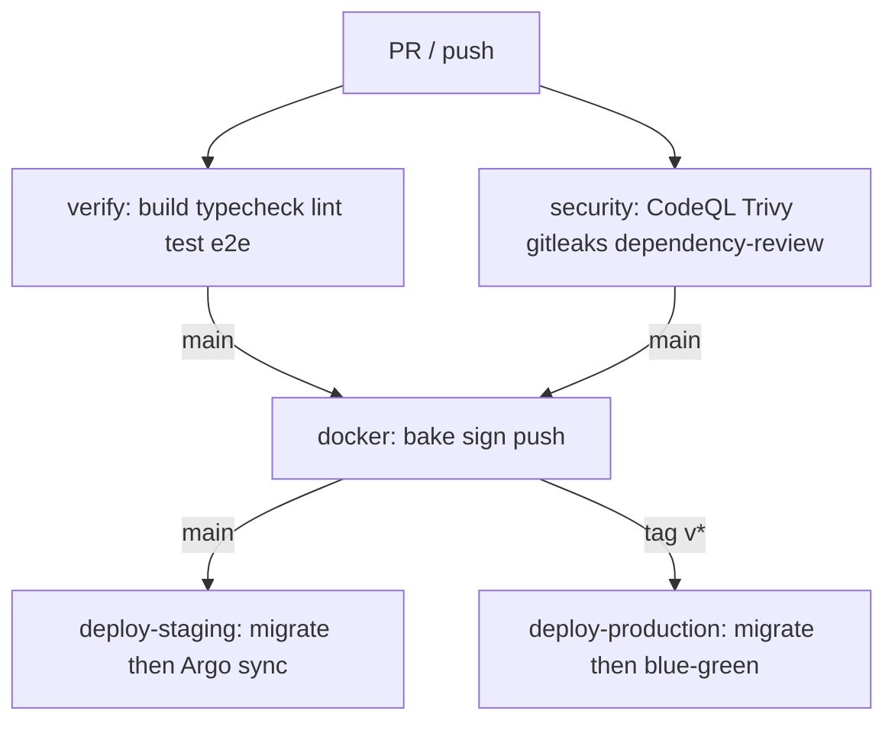
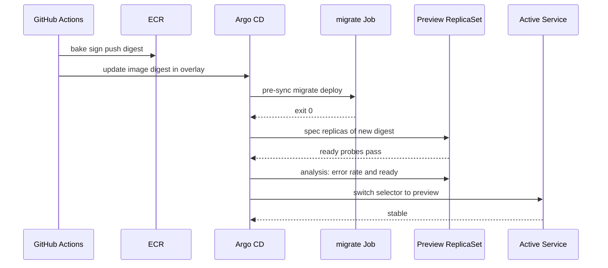
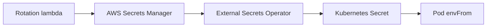
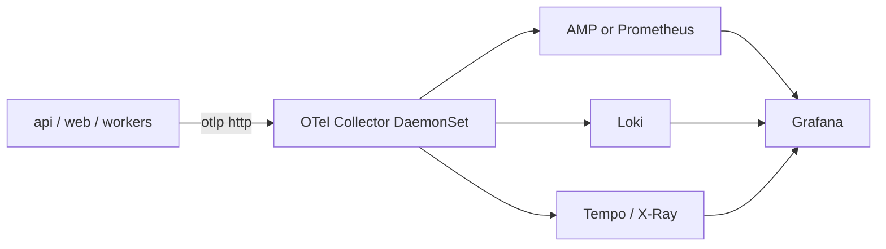
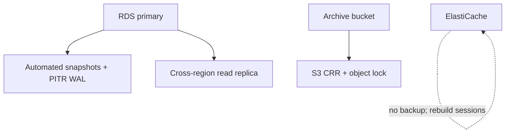

# Zion8 DevOps

How Zion8 is built, shipped, observed, recovered, and paid for. This document is
normative for production. Local `docker compose` remains the inner-loop stack;
it is not a miniature of AWS.

See [ADR 0003](../adr/0003-gitops-blue-green-on-eks.md) for why GitOps blue-green
on EKS is the production path.

## Guiding constraints

1. **The product is a modular monolith.** `apps/api` is one process with many
   bounded contexts. A bad deploy takes check-in, giving, and the archive
   together. Rollouts must be reversible in one traffic shift.
2. **PostgreSQL is the system of record.** Redis, OpenSearch, and object storage
   can be rebuilt. Backups, PITR, and tenant isolation all start at RDS.
3. **Images are built in CI, never in the cluster.** The cluster only pulls
   signed digests.
4. **Secrets never enter git.** AWS Secrets Manager plus External Secrets
   Operator. GitHub OIDC talks to AWS; there is no long-lived cloud key in
   Actions.
5. **Production promotion is a signed tag.** Merge to `main` ships staging.
   `vX.Y.Z` ships production.
6. **Workers share the API image and not the API replica set.** In-process
   pollers (`SKIP LOCKED`) must not run N times just because the API scaled.

## Environments

| Environment | Cluster | Data | Trigger | Traffic |
| --- | --- | --- | --- | --- |
| local | docker compose | synthetic | `pnpm dev` | none |
| preview | ephemeral namespace | synthetic | PR label `preview` | unique hostname |
| staging | EKS staging | anonymized production-like | merge to `main` | rolling |
| production | EKS production | live | signed tag `v*` | blue-green |

Staging runs the same images, the same migrations, and the same topology as
production. It differs in replica count, instance size, and data. If a bug
cannot be reproduced on staging, the difference is a configuration defect.



## Target topology



The Next.js app remains the public origin. It already reverse-proxies `/api/*`
to the API (`apps/web/next.config.ts`). Ingress still routes `/api` and
`/graphql` directly to the API so health probes, webhooks, and the mobile
client do not depend on the web process.

Workers are the **same OCI image** as the API, with:

- `OUTBOX_RELAY_ENABLED=true`
- `MEMORY_WORKER_ENABLED=true`
- `AI_WORKER_ENABLED=true`
- `SERMON_WORKER_ENABLED=true`
- `NOTIFICATION_WORKER_ENABLED=true`

API replicas set those flags to `false`. Job claiming stays `FOR UPDATE SKIP
LOCKED` in Postgres; adding API replicas must not multiply pollers.

OpenSearch and NATS JetStream are provisioned but not required for boot. The
API already degrades: Redis down is `degraded` on `/api/v1/health/ready`;
Postgres down is `down`. Search and the broker follow the same rule when they
are wired.

## Docker

Images live under `infrastructure/docker`. Bake file:
`infrastructure/docker/docker-bake.hcl`.

| Image | Context | Notes |
| --- | --- | --- |
| `zion8/api` | monorepo, `api.Dockerfile` | NestJS `dist/main.js`, non-root, Prisma client generated at build |
| `zion8/web` | monorepo, `web.Dockerfile` | Next.js `output: 'standalone'` |
| `zion8/migrate` | same as API | entrypoint `prisma migrate deploy` using `MIGRATION_DATABASE_URL` |

Rules:

- Multi-stage, `node:22-bookworm-slim`, pnpm via Corepack.
- Production stage runs as uid `10001`, read-only root filesystem in
  Kubernetes, tmpfs for `/tmp`.
- Tags: `git-sha`, `vX.Y.Z`, and `staging`. Production Deployments pin a
  **digest**, not a floating tag.
- SBOM (Syft) and signature (cosign, keyless OIDC) are artifacts of the
  image job.
- Base images are pinned by digest in bake HCL and rebuilt weekly.

Local compose (`docker-compose.yml`) still only runs Postgres, Redis, and
OpenSearch. App processes stay on the host for the inner loop. An optional
overlay `infrastructure/docker/compose/apps.yml` builds API and web when a
developer wants the full container path.

## GitHub Actions pipeline

Current `ci.yml` is the PR gate (build, typecheck, lint, unit, migrate, e2e
against service containers). Enterprise CI adds reusable workflows and
environment promotion.



| Workflow | When | What |
| --- | --- | --- |
| `.github/workflows/ci.yml` | every PR and push | existing verify job |
| `.github/workflows/security.yml` | every PR and push | CodeQL, Trivy fs, gitleaks, dependency-review |
| `.github/workflows/docker.yml` | `main` and tags | bake, SBOM, cosign, push to ECR |
| `.github/workflows/deploy-staging.yml` | `main` after docker | migrate Job, Argo sync staging |
| `.github/workflows/deploy-production.yml` | tag `v*` | migrate Job, Argo Rollout blue-green |
| `.github/workflows/mobile-release.yml` | tag `mobile-v*` | placeholder until store credentials exist |

Concurrency groups cancel in-progress PR runs. Production deploys never
cancel; they fail closed.

OIDC: `role/zion8-gha-staging` and `role/zion8-gha-production` in AWS. The
workflow requests a token scoped to the environment. There is no
`AWS_SECRET_ACCESS_KEY` in GitHub.

## Kubernetes

Layout:

```
infrastructure/kubernetes/
  base/                 kustomize: api, web, workers, migrate, network policies
  overlays/staging/
  overlays/production/  Rollout instead of Deployment for api and web
  gitops/               Argo CD Application manifests
```

### Workloads

| Workload | Kind | Probes | Notes |
| --- | --- | --- | --- |
| `api` | Deployment / Rollout | live `/api/v1/health/live`, ready `/api/v1/health/ready` | HPA on CPU and RPS |
| `web` | Deployment / Rollout | live and ready `/healthz` | HPA on CPU |
| `workers` | Deployment | live `/api/v1/health/live`, ready postgres ping | replicas=2 in prod, no HPA on RPS |
| `migrate` | Job | n/a | `MIGRATION_DATABASE_URL`, Helm/Argo pre-sync hook, TTL 1h |

### Deployment workflow



Production (`overlays/production`):

1. Argo pre-sync runs `migrate` against RDS with the owner role.
2. Argo Rollouts creates the **preview** ReplicaSet for `api` and `web`.
3. Analysis: 5 consecutive ready probes, 5xx ratio below 1% for 5 minutes,
   p95 latency within 20% of the previous ReplicaSet.
4. The Service selector moves. Preview becomes active. The previous set stays
   scaled for `scaleDownDelaySeconds` (15 minutes) so abort is instant.
5. Abort auto-promotes the previous set. A human does not "cut back"; they
   inspect why analysis failed.

Staging uses a rolling update. Doubling capacity on every staging push is
waste.

Workers are **not** blue-green. A rolling update of 2 replicas is enough:
`SKIP LOCKED` makes overlapping pollers safe. Drain is SIGTERM plus the
NestJS shutdown hook already enabled in `main.ts`.

### Auto scaling

| Workload | Min staging | Min prod | Max prod | Metric |
| --- | --- | --- | --- | --- |
| api | 2 | 3 | 20 | CPU 60% and ALB requests/pod |
| web | 2 | 3 | 15 | CPU 60% |
| workers | 1 | 2 | 6 | Postgres queue depth (pending outbox / memory / notification jobs) |

Cluster Autoscaler (or Karpenter) adds nodes. PodDisruptionBudgets: `minAvailable: 2`
for api and web in production. Disruption during a blue-green preview counts
against a separate PDB on the preview ReplicaSet.

HPA never scales to zero. A church on Sunday morning cannot wait for a cold
start. Scale-to-zero is reserved for preview namespaces.

### Network and runtime security

- Default-deny NetworkPolicy. `web` may talk to `api:4000`. `api` and
  `workers` may talk to RDS, Redis, S3 (via NAT/gateway), and the in-cluster
  OpenTelemetry collector. Ingress pods may talk to `web:3000` and `api:4000`.
- `securityContext`: non-root, `readOnlyRootFilesystem`, drop all
  capabilities, `seccompProfile: RuntimeDefault`, no privilege escalation.
- Pods do not mount the cloud instance role. IRSA roles are per-service:
  `zion8-api` may `GetObject`/`PutObject` on the archive bucket and
  `GetSecretValue` is **not** granted to the app role (External Secrets
  writes a Kubernetes Secret instead).
- Kyverno policies in `infrastructure/kubernetes/policies` reject `latest`
  tags and privileged or root pods. Unsigned-image admission waits on
  cluster-side cosign keys.

## Terraform

```
infrastructure/terraform/
  modules/vpc
  modules/eks
  modules/rds
  modules/redis
  modules/s3
  modules/ecr
  modules/secrets
  modules/observability
  environments/staging
  environments/production
```

State: S3 backend, DynamoDB lock, one state file per environment. Plan is
required in CI on every change to `infrastructure/terraform/**`; apply is a
manual GitHub Environment approval for production.

RDS:

- PostgreSQL 16, Multi-AZ, `pgvector` / `pgcrypto` / `citext`.
- Two roles, matching local init: owner (`zion8`) for migrations, app
  (`zion8_app`) with `NOBYPASSRLS`.
- Encryption at rest (KMS CMK), SSL required, backup retention 7 days
  staging / 35 days production, PITR enabled.
- Not publicly accessible. EKS nodes reach it through a dedicated subnet
  security group.

ElastiCache: Redis 7, encryption in transit, auth token from Secrets
Manager, no dump to disk that contains session material in a shared snapshot
without KMS.

S3: archive bucket with versioning, object lock governance on production,
block public access, lifecycle to IA after 90 days and Glacier Instant
Retrieval after 365 days for artifacts churches still own.

## Secrets management



| Secret | Rotation | Consumers |
| --- | --- | --- |
| `DATABASE_URL` (app role) | 30 days, overlapping users | api, workers |
| `MIGRATION_DATABASE_URL` | 30 days | migrate Job only |
| `REDIS_URL` | 30 days | api, workers |
| `JWT_ACCESS_SECRET` | 90 days, dual-key accept | api |
| `ENCRYPTION_KEY` | annual, dual-key decrypt | api |
| `RESEND_API_KEY`, `TWILIO_*` | provider-driven | workers |
| `USER_LLM_API_KEY`, `AI_*_API_KEY` | tenant-supplied, never platform | api, workers |

Rules:

- `.env` files are gitignored. `.env.example` documents names only.
- GitHub Actions secrets are limited to OIDC role ARNs and the Cosign
  identity. Application secrets are not copied into GitHub.
- A secret change restarts pods via a Reloader annotation on the digest of
  the Kubernetes Secret.
- `ENCRYPTION_KEY` decrypts MFA material. Rotation must keep the previous
  key until every credential row is re-wrapped. That job is a runbook, not
  an in-place overwrite.

## Monitoring, logging, tracing

The API already emits structured JSON via Pino with `requestId`, `tenantId`,
and `userId` (`AppLogger` + `AsyncLocalStorage`). DevOps does not replace
that; it ships it.



### Metrics

- RED for `/api/v1/*`: rate, errors, duration. Histogram buckets in
  milliseconds: 25, 50, 100, 250, 500, 1000, 2500, 5000.
- Worker gauges: `zion8_outbox_pending`, `zion8_memory_jobs_pending`,
  `zion8_notification_messages_pending{status="PENDING|SENDING"}`.
- Postgres: connections, deadlocks, RLS policy errors, replication lag.
- SLOs (production, 30-day):
  - API availability 99.9% excluding maintenance windows.
  - p95 read endpoints under 300ms, write under 800ms.
  - Notification claim-to-sent p95 under 60s when a provider is configured.

Alert routing: PagerDuty for SLO burn (2% of monthly error budget in 1 hour,
or 10% in 6 hours). Slack for warning. Sunday 07:00–13:00 local to the
majority of tenants is a tighter page window, not a different system.

### Logging

Pino JSON to stdout. Promtail / Grafana Alloy tails the kubelet log. Indexes
on `requestId`, `tenantId`, `level`. Bodies, tokens, and magic links are
never logged; the existing mailer already avoids that. Retention 14 days
hot, 90 days cold.

### Tracing

OpenTelemetry SDK in the API (to be wired on the existing request id). The
incoming `x-request-id` becomes the trace correlation key even before a full
SDK lands, so log-to-trace join works on day one. Sample 10% in production,
100% when `x-zion8-trace: 1` is present on a staff request.

Dashboards as code: `infrastructure/observability/grafana/`.

## Disaster recovery

| Scenario | RPO | RTO | Mechanism |
| --- | --- | --- | --- |
| AZ failure | 0 (sync Multi-AZ) | 5 minutes | RDS failover, EKS nodes in three AZs |
| Region failure | 5 minutes | 4 hours | Postgres replica in the paired region, S3 CRR, Terraform for a warm EKS |
| Bad migration | 0 if aborted | 30 minutes | migrate Job fails, Rollout never starts; restore from PITR if it committed |
| Ransomware / bad actor | 24 hours immutable | 8 hours | S3 object lock, RDS backups in a separate account |
| Kubernetes control plane | 0 | 15 minutes | EKS SLA; apps are stateless |

Runbooks: `docs/runbooks/`. Restore is rehearsed quarterly on staging by
applying a PITR snapshot under a new name and pointing a preview namespace
at it.

Failover is **not** automatic across regions. A human confirms the primary
region is unrecoverable so a split brain cannot fork the ledger.

## Backup strategy



- **PostgreSQL:** daily snapshots, 35-day retention in production, PITR
  continuous. Snapshot copy to a backup AWS account. Restore test monthly.
- **S3:** versioning plus CRR. Memory artifacts and sermon media are
  immutable blobs; deleting a church is a legal process, not a lifecycle
  rule.
- **Redis:** no backup. Sessions and locks rebuild. A flush is uncomfortable,
  not a data-loss event.
- **OpenSearch:** rebuild from Postgres. Index jobs are idempotent.
- **Kubernetes:** Argo CD is the backup of desired state. etcd snapshots are
  Amazon's problem; we do not store unique data there.

Tenant export (church leaves the platform) is a product feature on top of
this, not a substitute for platform backups.

## Security controls

| Layer | Control |
| --- | --- |
| SCM | protected `main`, merge queue, CODEOWNERS, signed commits optional, secret scanning |
| CI | frozen lockfile, OIDC, no production secrets in GitHub, Trivy, CodeQL, license allowlist |
| Supply chain | digest-pinned bases, cosign keyless, SBOM attached to the image, Kyverno verify |
| Build | pnpm `onlyBuiltDependencies`, no unreviewed postinstall |
| Runtime | non-root, read-only FS, NetworkPolicy, IRSA, WAF on CloudFront |
| Data | RLS, `NOBYPASSRLS` app role, KMS at rest, TLS in transit |
| Secrets | Secrets Manager, ESO, rotation, Reloader |
| Access | SSO to AWS and Argo CD, no standing `kubectl` as cluster-admin |

WAF: AWS managed core rule set, rate limit on `/api/v1/auth/login`, geo is
**not** used to block (churches travel). Bot control on public sermon pages
only.

## Cost optimization

These are recommendations with an owner, not a hope.

1. **One cluster per environment, Karpenter, Graviton.** API and web run on
   `m7g`. Spot for workers and preview only — never for `api` on Sunday.
2. **Blue-green cost is temporary.** `scaleDownDelaySeconds: 900` then the
   old ReplicaSet dies. Do not leave preview sets around.
3. **RDS right-size from connections, not folklore.** `connection_limit=10`
   per pod is already in `DATABASE_URL`. PgBouncer in front of RDS if pod
   count exceeds `max_connections / 10`. Until then, skip the proxy.
4. **Redis is cache.** Do not pay for MemoryDB. Auth tokens in Redis can
   vanish.
5. **S3 lifecycle.** Artifacts older than 90 days to IA; sermon masters to
   Glacier IR after a year. The product still lists them; first play may
   wait.
6. **OpenSearch is optional until search SLOs require it.** Postgres FTS
   plus pgvector cover Phase 2. Do not run a 3-node domain "because the
   compose file has it".
7. **CI.** Affected-only Turbo once remote cache exists. Cancel-in-progress
   on PR. Build images only when `apps/**`, `packages/**`, or Dockerfiles
   change.
8. **Logs.** Drop `debug` in production. Sample traces at 10%.
9. **NAT.** One NAT per AZ is the reliability default; a single NAT in
   staging is an accepted saving.
10. **Review Savings Plans quarterly** after 60 days of production metrics.
    Do not buy a 3-year plan on guesswork.

Estimated idle staging (order of magnitude, not a quote): one `m7g.large`
node group, `db.t4g.medium` Multi-AZ off, `cache.t4g.small`, pennies of S3.
Production starts at three AZs, `db.r6g.large` Multi-AZ, and scales with
churches, not with microservices.

## What is explicitly out of scope

- Installing a third-party agent runtime in CI.
- Using the developer environment as a tunnel or public panel.
- Per-church Kubernetes clusters. Isolation is RLS, not a cluster.
- Replacing the in-process outbox with NATS as a go-live prerequisite.

## Related

- `docs/architecture/ARCHITECTURE.md` — system shape
- `docs/architecture/REPOSITORY_STRUCTURE.md` — GitOps layout and env matrix
- `docs/architecture/MULTI_TENANCY.md` — why the app role cannot bypass RLS
- `docs/runbooks/deploy.md` — human steps for a production tag
- `docs/runbooks/restore-postgres.md` — PITR restore
- `infrastructure/` — Docker, Kubernetes, Terraform, observability
